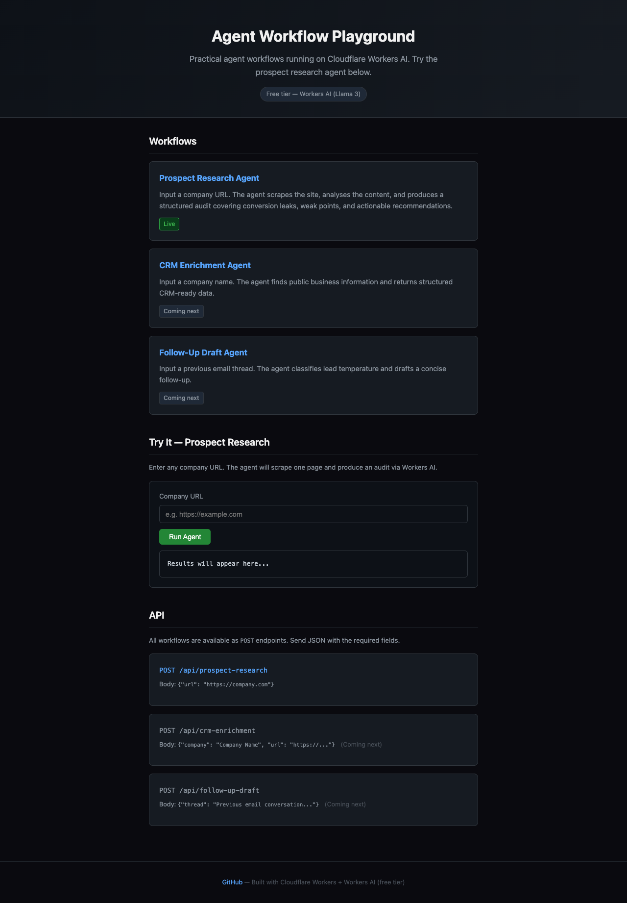
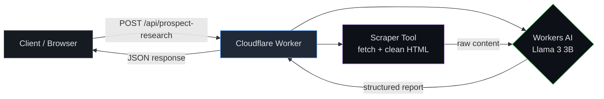

# Agent Workflow Playground

**Practical agent workflows that solve real business problems — deployed on Cloudflare Workers AI, powered by Llama 3, and free to use.**

> Live demo: [agent-workflow-playground.yahya-shehabi01.workers.dev](https://agent-workflow-playground.yahya-shehabi01.workers.dev)

---

## What this is

This repo demonstrates that I can design, build, deploy, and document agentic systems that do real work — not just wrap an LLM call. Each workflow is a self-contained agent with:

- A clear input/output contract
- Tool use (web scraping, LLM analysis, structured output)
- Error handling and fallbacks
- A deployed API endpoint with a live demo

Hiring managers should read this as: **this person builds agents as operational systems, not prompt wrappers.**

---

## Workflows

| Workflow | Status | Description |
|----------|--------|-------------|
| **Prospect Research Agent** | Live | Input a company URL. The agent scrapes the site, analyses the content with Workers AI, and produces a structured audit covering conversion leaks, weak points, and recommendations. |
| CRM Enrichment Agent | Coming next | Input a company name. Returns structured CRM-ready business data. |
| Follow-Up Draft Agent | Coming next | Input an email thread. Classifies lead temperature and drafts a follow-up. |

---

## Demo

### Landing page



### Example: Prospect Research Report

Run the prospect research agent against any company URL:

```bash
curl -X POST https://agent-workflow-playground.yahya-shehabi01.workers.dev/api/prospect-research \
  -H 'Content-Type: application/json' \
  -d '{"url": "https://www.berghs.se"}'
```

**Response:**

```json
{
  "success": true,
  "url": "https://www.berghs.se",
  "metadata": {
    "pageTitle": "Berghs School of Communication",
    "pageLength": 2545,
    "scrapeSuccess": true
  },
  "report": "**Website Audit Report**\n\n**1. Company Overview**\n\nBerghs School..."
}
```

Full example output: [docs/screenshots/example-report.md](docs/screenshots/example-report.md)

---

## Architecture



### How the Prospect Research Agent works

1. **Input validation** — Normalises the URL (adds `https://` if missing).
2. **Tool: scrape_page** — Fetches the URL, strips HTML/JS/CSS, extracts readable text content. Handles redirects, timeouts, and non-200 responses gracefully.
3. **Tool: Workers AI inference** — Sends the scraped content to Llama 3.2 3B with a structured system prompt that instructs the model to act as a senior business analyst.
4. **Output** — Returns a markdown audit with sections: Company Overview, Website Assessment, Conversion Leaks, Actionable Recommendations, Competitive Notes.
5. **Fallback** — If the primary model is unavailable, tries up to 3 alternative models automatically.

---

## Stack

| Layer | Choice | Why |
|-------|--------|-----|
| Runtime | Cloudflare Workers | Edge serverless, 100k req/day free tier |
| AI | Workers AI (Llama 3.2 3B) | Free tier, no API key needed |
| Language | TypeScript | Type safety, workers-types |
| Frontend | Inline HTML + CSS | Zero build step, ships with the Worker |
| Deploy | Wrangler CLI | One-command deploy |

### Project structure

```
src/
├── index.ts                     # Worker entry — routing, CORS, error handling
├── lib/
│   ├── ai.ts                    # AI abstraction — model fallback chain
│   ├── scraper.ts               # URL scraping tool
│   └── prompts.ts               # System prompts per workflow
├── workflows/
│   ├── prospect-research.ts     # Prospect research agent (live)
│   ├── crm-enrichment.ts        # CRM enrichment (placeholder)
│   └── follow-up-draft.ts       # Follow-up draft (placeholder)
└── frontend/
    └── index.html.js            # Landing page HTML as JS string
wrangler.jsonc                   # Worker config
```

---

## Run locally

```bash
# Clone
git clone https://github.com/yahyashihabe/agent-workflow-playground
cd agent-workflow-playground

# Install (skip sharp native build — not needed for Workers)
npm install --ignore-scripts

# Generate types
npx wrangler types

# Start local dev server
npx wrangler dev
```

Then in another terminal:

```bash
curl -X POST http://localhost:8787/api/prospect-research \
  -H 'Content-Type: application/json' \
  -d '{"url": "https://example.com"}'
```

### Deploy

```bash
npx wrangler deploy
```

---

## API

All endpoints accept `POST` with `Content-Type: application/json`.

### `POST /api/prospect-research`

| Field | Type | Required | Description |
|-------|------|----------|-------------|
| `url` | string | yes | Company website URL |

**Response shape:**

```json
{
  "success": true,
  "url": "https://...",
  "report": "markdown audit...",
  "metadata": {
    "pageTitle": "Page title",
    "pageLength": 1234,
    "scrapeSuccess": true
  }
}
```

### `POST /api/crm-enrichment` (coming next)

### `POST /api/follow-up-draft` (coming next)

---

## Business problem

Small and medium businesses (SMBs) lose customers because their websites leak conversions — unclear CTAs, missing contact info, weak value propositions, no trust signals. Most business owners don't see these leaks because they're too close to their own site.

This agent automates the first step of sales prospecting: instead of manually visiting a site and making notes, paste a URL and get a structured audit in seconds. It's the same thinking I apply to building AI receptionists, CRM enrichment pipelines, and email follow-up automation for Swedish SMBs.

See the full agency offer at [yahya-shihabe.pages.dev](https://yahya-shihabe.pages.dev).

---

## Safety and limitations

- **Scraping depends on Workers IPs** — some sites block Cloudflare edge IPs or require JavaScript rendering. The scraper handles this gracefully and reports when content is too limited.
- **Model is a small Llama 3** — 3B parameters is enough for structured analysis but may miss nuance that larger models catch. The prompt is designed to compensate with explicit structure.
- **Single-page analysis only** — the current agent scrapes one URL (typically the homepage). A production version would crawl multiple pages.
- **Free tier is limited** — Workers AI free tier has rate limits. For high-volume use, upgrade to a paid plan or swap in a paid provider via the abstraction layer.
- **No authentication** — the demo endpoints are public. Rate limiting can be added with Cloudflare Rate Limiting or Turnstile.

---

## What's next

- [ ] CRM enrichment agent: structured company data extraction
- [ ] Follow-up draft agent: email thread analysis + draft generation
- [ ] Multi-page crawling for deeper site analysis
- [ ] Human-in-the-loop verification step for high-stakes outputs
- [ ] Authentication for production use

---

## License

MIT
