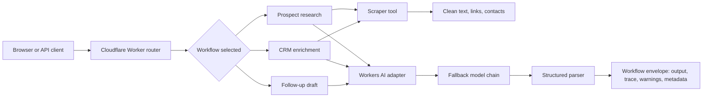

# Agent Workflow Playground

Three runnable agent workflows for sales and research operations, deployed on Cloudflare Workers AI.

Live demo: <https://agent-workflow-playground.yahya-shehabi01.workers.dev>
GitHub repo: <https://github.com/06Yahya/agent-workflow-playground>


## Why this exists

This is a portfolio proof project. It shows that I can build agents as operational systems: inputs, tools, model routing, structured outputs, trace logs, fallbacks, API contracts, deployment, and documentation.

It is not just a chatbot UI. Each workflow has a business job and a verifiable output.

## Workflows

| Workflow | Input | Tools and reasoning | Output |
| --- | --- | --- | --- |
| Prospect research | Company URL | Scrapes the page, extracts evidence, runs conversion analysis | Markdown audit with conversion leaks, trust signals, fixes, and sales angle |
| CRM enrichment | Company name plus optional URL | Scrapes public evidence, extracts contacts, classifies tags and segment | CRM-ready JSON with confidence, tags, lead score, next action |
| Follow-up draft | Previous email thread | Classifies lead temperature, applies sales constraints, drafts next message | JSON with temperature, reasoning, subject, email, next action, risk flags |

## Architecture



### Design choices

- Cloudflare Worker instead of a heavy web framework: the proof is small, fast, deployable, and easy to inspect.
- Workers AI adapter behind `src/lib/ai.ts`: model choice can be swapped without rewriting workflow logic.
- Workflow envelope for every response: output plus trace, warnings, metadata, and duration.
- Deterministic fallbacks for structured workflows: the CRM and follow-up endpoints still return useful bounded output when model JSON parsing fails.
- No database by design: this showcase proves agent workflow orchestration, not storage. Showcase 1 covers lead persistence.

## API

All endpoints accept `POST` JSON and return a common envelope:

```ts
type WorkflowEnvelope<T> = {
  success: boolean;
  workflow: string;
  input: Record<string, unknown>;
  output?: T;
  trace: TraceStep[];
  warnings: string[];
  error?: string;
  metadata: {
    generatedAt: string;
    durationMs: number;
    model?: string;
  };
};
```

### `POST /api/prospect-research`

```bash
curl -X POST https://agent-workflow-playground.yahya-shehabi01.workers.dev/api/prospect-research \
  -H 'Content-Type: application/json' \
  -d '{"url":"https://example.com"}'
```

### `POST /api/crm-enrichment`

```bash
curl -X POST https://agent-workflow-playground.yahya-shehabi01.workers.dev/api/crm-enrichment \
  -H 'Content-Type: application/json' \
  -d '{"company":"Example Inc","url":"https://example.com"}'
```

### `POST /api/follow-up-draft`

```bash
curl -X POST https://agent-workflow-playground.yahya-shehabi01.workers.dev/api/follow-up-draft \
  -H 'Content-Type: application/json' \
  -d '{"thread":"Hi Yahya, sounds interesting. Can you send pricing?"}'
```

## Project structure

```text
src/
├── frontend/landing-page.ts       # Live console UI served by the Worker
├── index.ts                       # Router, CORS, endpoint handling
├── lib/
│   ├── ai.ts                      # Workers AI adapter, fallback models, JSON parser
│   ├── prompts.ts                 # Workflow-specific system prompts
│   ├── scraper.ts                 # URL normalisation, fetch, HTML cleaning, contact extraction
│   └── trace.ts                   # Trace and timing helpers
├── types.ts                       # Shared workflow envelope types
└── workflows/
    ├── prospect-research.ts       # URL to conversion audit
    ├── crm-enrichment.ts          # Company evidence to CRM JSON
    └── follow-up-draft.ts         # Email thread to next action
scripts/verify-remote.mjs          # Remote API smoke test
tests/scraper.test.mjs             # Node tests for extraction behaviour
wrangler.jsonc                     # Cloudflare Worker configuration
```

## Run locally

```bash
git clone https://github.com/06Yahya/agent-workflow-playground.git
cd agent-workflow-playground
npm install --ignore-scripts
npm run types
npm run typecheck
npm test
npm run dev
```

Open <http://localhost:8787>, or call an endpoint:

```bash
curl -X POST http://localhost:8787/api/crm-enrichment \
  -H 'Content-Type: application/json' \
  -d '{"company":"Example Inc","url":"https://example.com"}'
```

## Deploy

```bash
npm run typecheck
npm test
npm run deploy
npm run verify:remote
```

Wrangler configuration uses the Cloudflare `AI` binding. No API key is committed or required for the public repo.

## Verification evidence

Current verification commands used before publishing:

```text
npm run typecheck
npm test
npm run deploy
npm run verify:remote
```

The README screenshot is generated from the deployed live demo and stored at `docs/screenshots/landing-page.png`.

## Safety and limitations

- Scraping is single-page only. It does not crawl a full site.
- Some websites block Cloudflare Workers or require JavaScript rendering.
- Workers AI output is probabilistic. The workflow exposes trace, warnings, and confidence instead of pretending every answer is final.
- CRM enrichment is not a source of truth. Human verification is expected before outreach.
- The follow-up workflow drafts copy, but a human should approve before sending.
- No authentication or rate limiting is included. For production, add Turnstile, Cloudflare Rate Limiting, or account-level auth.

## What this proves

- TypeScript Cloudflare Worker deployment
- Practical agent orchestration beyond chat
- Tool use and evidence gathering
- Structured outputs and model fallback handling
- API design and employer-readable documentation
- Product taste: live demo, traceability, screenshots, and clear limitations

## License

MIT
